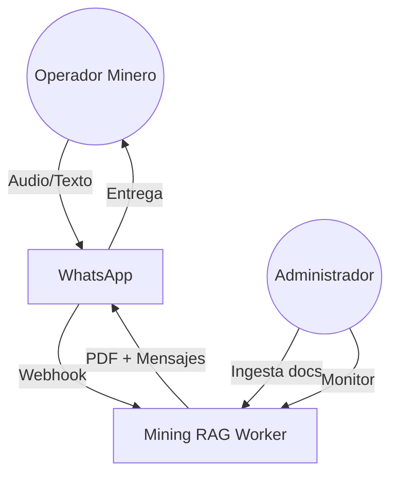
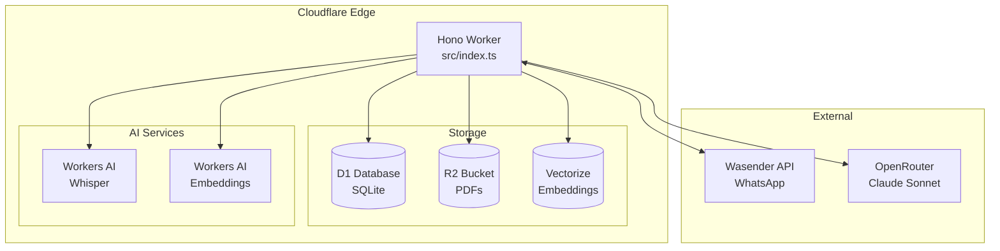
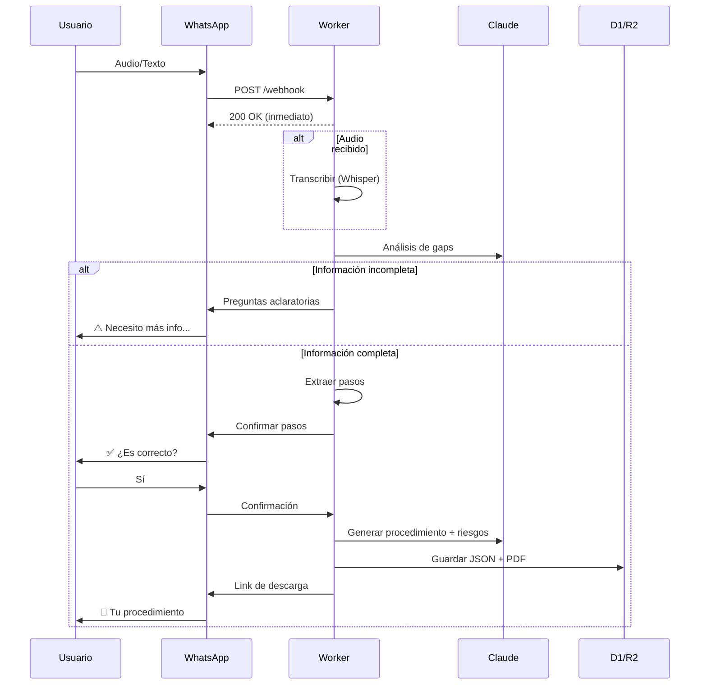

# Arquitectura del Sistema Mining RAG

## Visión General

Mining RAG es un sistema de generación automática de procedimientos mineros estandarizados, operando sobre **Cloudflare Workers**. Convierte descripciones de tareas (texto/audio vía WhatsApp) en documentos **DOCX** profesionales con:
- Análisis de riesgos automático
- **Riesgos de fatalidad** (24 RF del Excel)
- **Riesgos de zona** (RC específicos por área, ej: POX)

---

## Diagrama de Contexto (C4 Level 1)

**Actores:**
- **Operador Minero**: Usuario final que describe tareas vía WhatsApp
- **Administrador**: Gestiona documentos base y monitorea el sistema

---

## Diagrama de Contenedores (C4 Level 2)

---

## Stack Tecnológico

| Capa | Tecnología | Propósito |
|------|------------|-----------|
| **Runtime** | Cloudflare Workers | Serverless edge computing |
| **Framework** | Hono.js | Routing HTTP ligero |
| **Database** | Cloudflare D1 | Persistencia SQL (SQLite) |
| **Vector DB** | Cloudflare Vectorize | Búsqueda semántica RAG |
| **Storage** | Cloudflare R2 | Almacenamiento de DOCX y templates |
| **Transcripción** | Cloudflare Whisper | Audio → Texto |
| **Embeddings** | Cloudflare AI | Vectorización de texto |
| **LLM** | MiniMax (OpenRouter) | Generación de contenido |
| **WhatsApp** | Wasender API | Mensajería bidireccional |
| **DOCX** | docxtemplater + pizzip | Generación de documentos Word |

---

## Flujo de Datos Principal

---

## Decisiones de Arquitectura

| Decisión | Justificación |
|----------|---------------|
| **Background Processing** | `ctx.waitUntil()` para evitar timeouts de 30s en generación |
| **RAG con Vectorize** | Búsqueda semántica en documentos base para contexto relevante |
| **Gap Analysis preventivo** | LLM valida completitud antes de generar, mejora calidad |
| **D1 + R2 separados** | Metadatos en SQL, binarios (DOCX) en object storage |
| **OpenRouter como gateway** | Flexibilidad para cambiar modelo LLM sin reescribir código |
| **DOCX con templates** | docxtemplater permite loops dinámicos para tablas de riesgos |
| **Riesgos por zona** | POX tiene matriz específica, otras zonas usan solo RF generales |

---

## Seguridad

- **Webhook Secret**: Header `X-Webhook-Secret` valida origen de mensajes
- **Admin Secret**: Rutas `/admin/*` protegidas con `X-Admin-Secret`
- **Secrets seguros**: API keys almacenadas via `wrangler secret`
- **Sanitización JSON**: Limpieza de respuestas LLM antes de parsing
