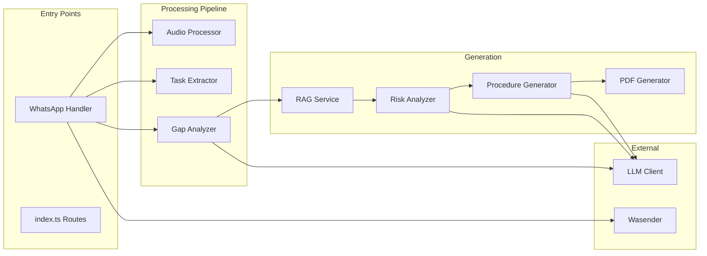

# Componentes del Sistema Mining RAG

Este documento detalla los 13 servicios que componen el sistema.

---

## Diagrama de Componentes



---

## 1. WhatsApp Handler

**Archivo:** `src/services/whatsapp-handler.ts`

**Responsabilidad:** Orquestador principal del flujo conversacional.

**Funciones:**
| Función | Descripción |
|---------|-------------|
| `handleWhatsAppMessage()` | Entry point. Recibe phone, texto/audio, procesa según estado |
| `handleTextMessage()` | Máquina de estados: `awaiting_audio` → `confirming` → `generating` |

**Estados del flujo:**
```
awaiting_audio → (gap analysis) → confirming → generating → completed
                      ↓
               (preguntas aclaratorias)
```

---

## 2. Audio Processor

**Archivo:** `src/services/audio-processor.ts`

**Responsabilidad:** Transcripción de notas de voz.

**Funciones:**
| Función | Descripción |
|---------|-------------|
| `transcribeAudio()` | Descarga audio, envía a Whisper, retorna texto |

**Tecnología:** Cloudflare Workers AI (Whisper)

---

## 3. Task Extractor

**Archivo:** `src/services/task-extractor.ts`

**Responsabilidad:** Extrae pasos estructurados de descripción libre.

**Funciones:**
| Función | Descripción |
|---------|-------------|
| `extractTaskSteps()` | LLM convierte texto a array de `TaskStep` |
| `formatStepsForDisplay()` | Formatea pasos para mostrar al usuario |

**Output:** Array de `TaskStep` con order, description, duration, equipment, etc.

---

## 4. Gap Analyzer

**Archivo:** `src/services/gap-analyzer.ts`

**Responsabilidad:** Valida completitud de información antes de generar.

**Funciones:**
| Función | Descripción |
|---------|-------------|
| `analyzeTaskGaps()` | Evalúa si faltan datos críticos de seguridad |

**Output:**
```typescript
interface GapAnalysisResult {
    hasGaps: boolean;
    questions: string[];  // 1-3 preguntas específicas
    feedback: string;
}
```

**Comportamiento:** Si `hasGaps=true`, el sistema pregunta al usuario antes de continuar.

---

## 5. RAG Service

**Archivo:** `src/services/rag.ts`

**Responsabilidad:** Búsqueda semántica en documentos base.

**Funciones:**
| Función | Descripción |
|---------|-------------|
| `ingestDocument()` | Chunking + embeddings + storage en Vectorize |
| `searchRelevantContext()` | Query semántico, retorna contexto relevante |
| `chunkDocument()` | Divide texto en chunks con overlap |
| `generateEmbeddings()` | Workers AI genera vectores |
| `analyzeDocument()` | LLM analiza documento para metadata |

**Parámetros de chunking:**
- `CHUNK_SIZE`: 400 tokens
- `CHUNK_OVERLAP`: 40 tokens

---

## 6. Risk Analyzer

**Archivo:** `src/services/risk-analyzer.ts`

**Responsabilidad:** Análisis automático de riesgos por tarea.

**Funciones:**
| Función | Descripción |
|---------|-------------|
| `analyzeRisks()` | LLM identifica riesgos críticos y generales |
| `calculateRiskLevel()` | Matriz severidad × probabilidad |
| `getStandardPPE()` | EPP base por área (Mecánica, Operaciones, etc.) |

**Output:**
```typescript
interface RiskAnalysis {
    critical_risks: Risk[];
    general_risks: Risk[];
    mitigation_measures: string[];
    ppe_summary: string[];
}
```

---

## 7. Procedure Generator

**Archivo:** `src/services/procedure-generator.ts`

**Responsabilidad:** Generación del procedimiento completo.

**Funciones:**
| Función | Descripción |
|---------|-------------|
| `generateProcedure()` | Orquesta RAG + Risk + LLM + PDF + Storage |
| `generateProcedureContent()` | LLM genera estructura `ProcedureContent` |
| `extractTaskTitle()` | Extrae título de descripción |
| `generateProcedureCode()` | Genera código PROC-XXX-NNN |

**Pipeline interno:**
1. Buscar prototipos relevantes (RAG)
2. Buscar matrices de riesgo (RAG)
3. Analizar riesgos
4. Generar contenido con LLM
5. Crear PDF
6. Subir a R2
7. Guardar en D1

---

## 8. PDF Generator

**Archivo:** `src/services/pdf-generator.ts`

**Responsabilidad:** Crear documento PDF profesional.

**Funciones:**
| Función | Descripción |
|---------|-------------|
| `generateProcedurePDF()` | Recibe `ProcedureContent`, retorna `ArrayBuffer` |

**Tecnología:** jsPDF

**Secciones del PDF:**
- Header con código y versión
- Objetivo y alcance
- Responsabilidades
- Pasos del procedimiento
- Análisis de riesgos (tabla)
- EPP requerido
- Referencias normativas

> **Nota:** Para nuevos procedimientos se usa DOCX Generator.

---

## 9. DOCX Generator

**Archivo:** `src/services/docx-generator.ts`

**Responsabilidad:** Generar documentos Word desde template con placeholders.

**Funciones:**
| Función | Descripción |
|---------|-------------|
| `generateDocxFromPrototype()` | Reemplaza placeholders con contenido generado |
| `loadActivePrototype()` | Carga template desde R2 |
| `saveGeneratedDocx()` | Guarda DOCX generado en R2 |

**Tecnología:** docxtemplater + pizzip

**Placeholders soportados:**
- `{objetivo}`, `{alcance}`, `{competencias}`...
- `{#riesgos_criticos}...{/riesgos_criticos}` (loop)

---

## 10. Content Generator

**Archivo:** `src/services/content-generator.ts`

**Responsabilidad:** Genera contenido de secciones con LLM.

**Funciones:**
| Función | Descripción |
|---------|-------------|
| `generateSectionContent()` | LLM genera objetivo, alcance, pasos, etc. |

---

## 11. Fatality Risk Service

**Archivo:** `src/services/fatality-risk-service.ts`

**Responsabilidad:** Consultar riesgos de fatalidad y zona desde D1.

**Funciones:**
| Función | Descripción |
|---------|-------------|
| `getAllFatalityRisks()` | Lista todos los 24 RF |
| `findRelevantRisks()` | Busca RF por keywords en descripción |
| `getZoneRisks()` | Obtiene RC de zona específica (POX) |
| `getAllRisksForProcedure()` | Combina RF generales + RC de zona |
| `getRiesgosForProcedure()` | Formatea para docxtemplater |

**Tablas D1:**
- `fatality_risks` - 24 riesgos de fatalidad (RF01-RF29)
- `fatality_risk_controls` - 33 controles críticos
- `zone_risks` - 10 riesgos zona POX (RC01-RC27)

---

## 12. LLM Client

**Archivo:** `src/services/llm.ts`

**Responsabilidad:** Abstracción de llamadas a LLM.

**Funciones:**
| Función | Descripción |
|---------|-------------|
| `callClaude()` | Envía prompt, recibe respuesta. Maneja JSON |

**Configuración:**
- **Modelo:** `minimax/minimax-01`
- **Gateway:** OpenRouter
- **Max tokens:** 4096

---

## 13. Wasender

**Archivo:** `src/services/wasender.ts`

**Responsabilidad:** Envío de mensajes WhatsApp.

**Funciones:**
| Función | Descripción |
|---------|-------------|
| `sendMessage()` | Envía texto a número de teléfono |
| `validateWebhookSecret()` | Valida header de seguridad |

---

## Resumen de Dependencias

```
whatsapp-handler
├── audio-processor (Whisper)
├── task-extractor (LLM)
├── gap-analyzer (LLM)
├── procedure-generator
│   ├── rag (Vectorize + AI)
│   ├── risk-analyzer (LLM)
│   ├── pdf-generator (jsPDF)
│   └── llm
└── wasender
```
