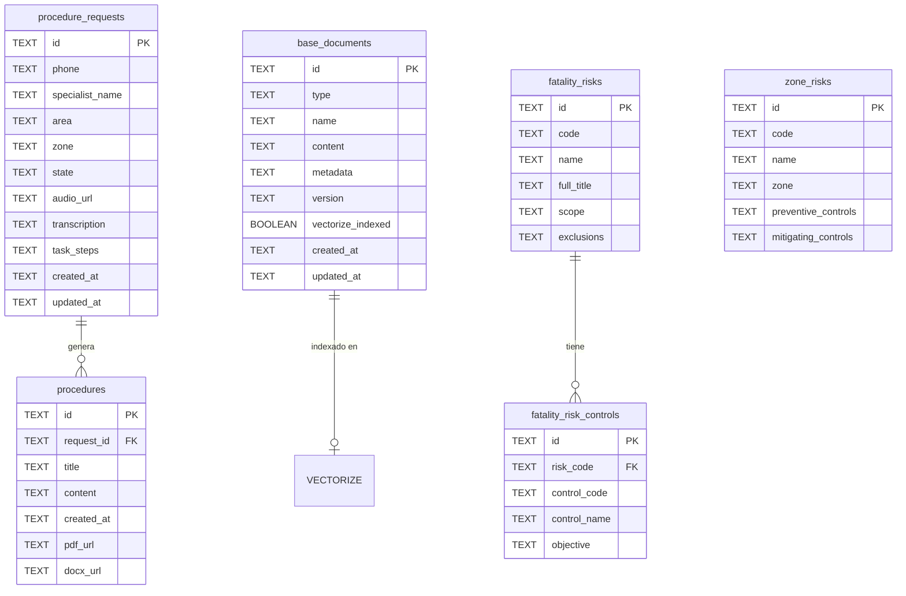
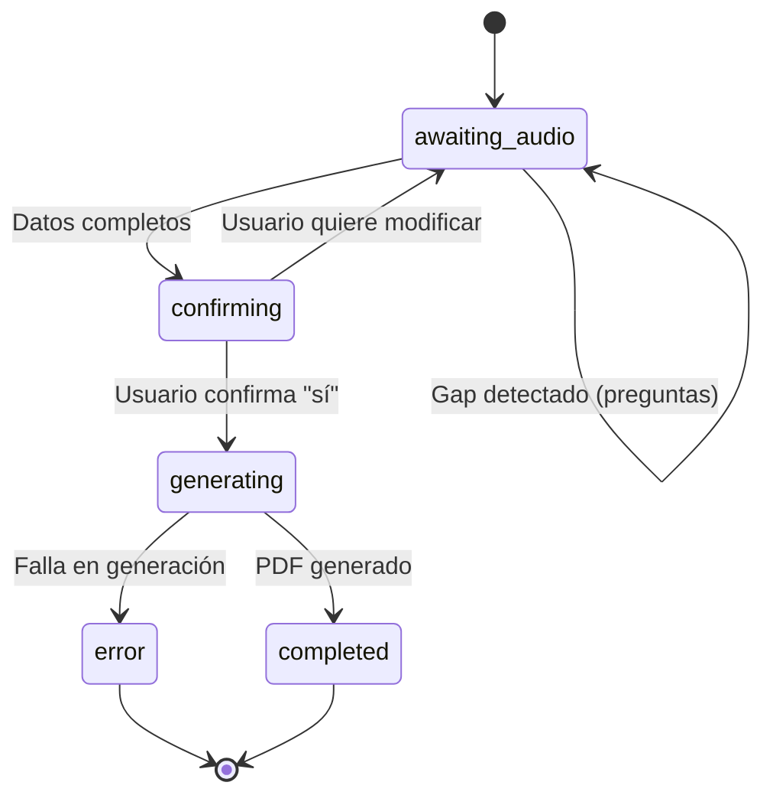

# Modelo de Datos - Mining RAG

Este documento describe el esquema de base de datos y las interfaces TypeScript.

---

## Diagrama Entidad-Relación



---

## Tablas D1

### `procedure_requests`

Solicitudes de procedimientos en curso.

| Columna | Tipo | Descripción |
|---------|------|-------------|
| `id` | TEXT PK | UUID de la solicitud |
| `phone` | TEXT | Número WhatsApp (56912345678) |
| `specialist_name` | TEXT | Nombre del operador (pushName) |
| `area` | TEXT | Área: Mecánica, Operaciones, Mantención, Eléctrica |
| `zone` | TEXT | Zona de trabajo: POX, Suministros, etc. |
| `state` | TEXT | Estado actual del flujo |
| `audio_url` | TEXT | URL del audio original (si aplica) |
| `transcription` | TEXT | Transcripción del audio o texto original |
| `task_steps` | TEXT | JSON stringified de TaskStep[] |
| `created_at` | TEXT | Timestamp ISO creación |
| `updated_at` | TEXT | Timestamp ISO última actualización |

**Índices:**
- `idx_requests_phone` → Búsqueda por teléfono
- `idx_requests_state` → Filtrar por estado

### `procedures`

Procedimientos generados.

| Columna | Tipo | Descripción |
|---------|------|-------------|
| `id` | TEXT PK | UUID del procedimiento |
| `request_id` | TEXT FK | Referencia a procedure_requests |
| `title` | TEXT | Título del procedimiento |
| `content` | TEXT | JSON stringified de ProcedureContent |
| `created_at` | TEXT | Timestamp ISO |
| `pdf_url` | TEXT | URL del PDF en R2 (legado) |
| `docx_url` | TEXT | URL del DOCX en R2 |

### `base_documents`

Documentos base para RAG (matrices, prototipos, normativas).

| Columna | Tipo | Descripción |
|---------|------|-------------|
| `id` | TEXT PK | UUID del documento |
| `type` | TEXT | Tipo: prototype, risk_critical, risk_general, regulation |
| `name` | TEXT | Nombre del documento |
| `content` | TEXT | Contenido textual completo |
| `metadata` | TEXT | JSON con análisis del LLM |
| `version` | TEXT | Versión (ej: "1.0") |
| `vectorize_indexed` | BOOLEAN | Si ya fue indexado en Vectorize |
| `created_at` | TEXT | Timestamp ISO |
| `updated_at` | TEXT | Timestamp ISO |

### `fatality_risks`

Riesgos de fatalidad extraídos del Excel RF Listado.

| Columna | Tipo | Descripción |
|---------|------|-------------|
| `id` | TEXT PK | UUID del riesgo |
| `code` | TEXT | Código RF (RF01, RF02, etc.) |
| `name` | TEXT | Nombre corto: ENERGÍA ELÉCTRICA |
| `full_title` | TEXT | Título completo del riesgo |
| `scope` | TEXT | Alcance del riesgo |
| `exclusions` | TEXT | Exclusiones |

**Índices:**
- `idx_fatality_risks_code` → Búsqueda por código

### `fatality_risk_controls`

Controles críticos por cada RF.

| Columna | Tipo | Descripción |
|---------|------|-------------|
| `id` | TEXT PK | UUID del control |
| `risk_code` | TEXT FK | Código RF del riesgo padre |
| `control_code` | TEXT | Código CCP (CCP1, CCP2, etc.) |
| `control_name` | TEXT | Nombre del control |
| `objective` | TEXT | Objetivo del control |

**Índices:**
- `idx_controls_risk` → Búsqueda por riesgo

### `zone_risks`

Riesgos específicos por zona (ej: POX).

| Columna | Tipo | Descripción |
|---------|------|-------------|
| `id` | TEXT PK | UUID del riesgo |
| `code` | TEXT | Código RC (RC01, RC02, etc.) |
| `name` | TEXT | Nombre del riesgo |
| `zone` | TEXT | Zona: POX, Suministros, etc. |
| `preventive_controls` | TEXT | Controles preventivos (CCP) |
| `mitigating_controls` | TEXT | Controles mitigadores (CCM) |

**Índices:**
- `idx_zone_risks_zone` → Filtrar por zona
- `idx_zone_risks_code` → Búsqueda por código

---

## Estados del Flujo (RequestState)



| Estado | Descripción |
|--------|-------------|
| `awaiting_audio` | Esperando descripción de tarea |
| `transcribing` | Procesando audio (transitorio) |
| `confirming` | Mostrando pasos, esperando confirmación |
| `generating` | Generando procedimiento con LLM |
| `completed` | Procedimiento entregado |
| `error` | Falla en el proceso |

---

## Interfaces TypeScript Principales

### TaskStep
```typescript
interface TaskStep {
    order: number;
    description: string;
    estimated_duration: string;
    requires_supervision: boolean;
    equipment_needed: string[];
    safety_notes: string;
}
```

### ProcedureContent
```typescript
interface ProcedureContent {
    title: string;
    code: string;           // PROC-XXX-001
    version: string;
    sections: {
        objective: string;
        scope: string;
        responsibilities: string[];
        definitions: Record<string, string>;
        procedure_steps: TaskStep[];
        risk_analysis: RiskAnalysis;
        control_measures: string[];
        ppe_required: string[];
        normative_references: string[];
    };
}
```

### RiskAnalysis
```typescript
interface RiskAnalysis {
    critical_risks: Risk[];
    general_risks: Risk[];
    mitigation_measures: string[];
    ppe_summary: string[];
}

interface Risk {
    description: string;
    severity: 'low' | 'medium' | 'high' | 'critical' | 'fatal';
    probability: 'low' | 'medium' | 'high';
    controls: string[];
    ppe_required: string[];
}
```

---

## R2 Storage

**Bucket:** `mining-documents`

**Estructura:**
```
mining-documents/
├── prototypes/
│   └── procedure-template-v1.docx    # Template con placeholders
├── procedures/
│   ├── {procedure-id}.pdf            # PDFs legados
│   └── {procedure-id}.docx           # Nuevos DOCX generados
└── audio/
    └── {audio-id}.ogg                # Audios transcritos
```

---

## Vectorize Index

**Nombre:** `procedure-embeddings`

**Configuración:**
- Dimensiones: 768
- Métrica: cosine

**Metadata por vector:**
```typescript
interface VectorMetadata {
    document_id: string;
    document_type: 'prototype' | 'risk_critical' | 'risk_general' | 'regulation';
    chunk_index: number;
    content: string;        // Texto del chunk
    section?: string;
    keywords?: string[];
}
```
